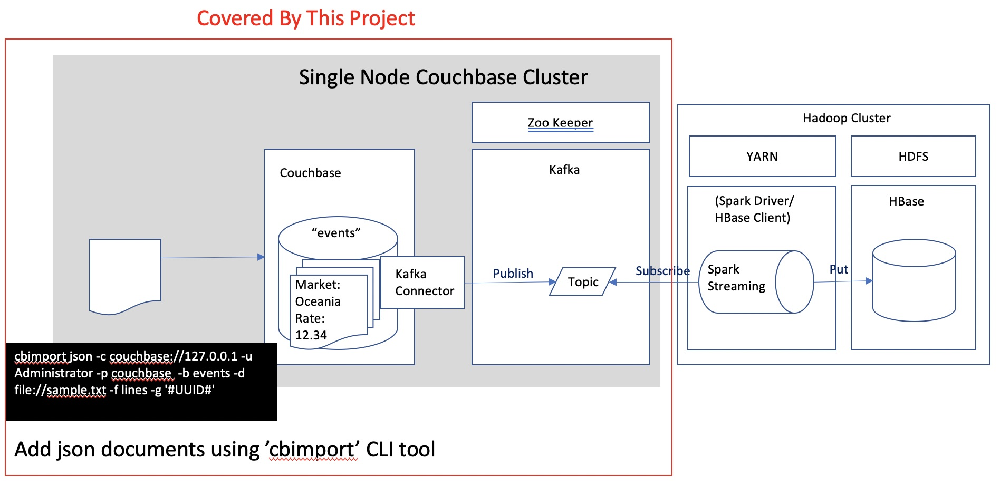

# Couchbase Kafka Connector, and Apache Kafka

This covers the following items.
- Setup Apache Kafka and Zookeeper
- Setup Couchbase Kafka Connector

## Concept Overview

## Project Coverage and Related Project

The rest is covered by [another project](https://github.com/YoshiyukiKono/kafka_spark-streaming_hbase)

## Environment
I confirmed with the following environment. I installed Apache Kafka and Zookeeper on the host where Couchbase is running.

- Cloud: AWS

- AMI: RHEL-7.7_HVM-20191119-x86_64-2-Hourly2-GP2
- Instance Type: t2.medium

## Couchbase Setup

[couchbase-aws-scripts](https://github.com/YoshiyukiKono/couchbase-aws-scripts)

## Kafka and Kafka Connector Setup

[kafka_setup](./kafka_setup.md)

## References
### Couchbase Kafka Connector
https://docs.couchbase.com/kafka-connector/4.0/quickstart.html

